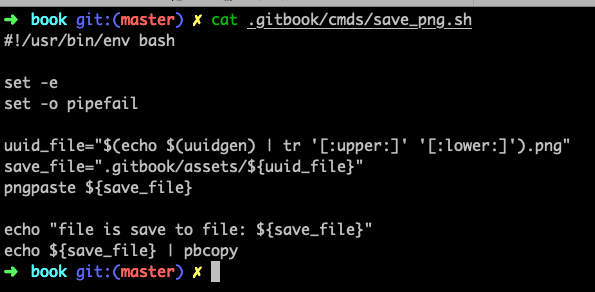
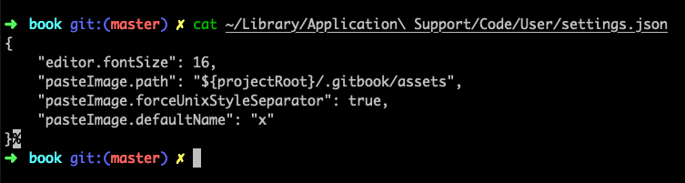

# 写作技巧

## 如何快速保存剪贴板的图片

```text
brew install pngpaste

uuid_file="$(echo $(uuidgen) | tr '[:upper:]' '[:lower:]').png"
save_file=".gitbook/assets/${uuid_file}"
pngpaste ${save_file}

echo "file is save to file: ${save_file}"
echo ${save_file} | pbcopy
```



## 如何在 vscode 编辑器中快速保存剪贴板的图片

* 首先安装插件 [Paste Image](https://marketplace.visualstudio.com/items?itemName=mushan.vscode-paste-image)
* 然后配置 Paste Image 插件
  * 存储位置为 `.gitbook/assets/`
  * 文件名称为 unix 时间戳
  * 保存下面的文件到 `~/Library/Application Support/Code/User/settings.json`

```javascript
{
    "pasteImage.path": "${projectRoot}/.gitbook/assets",
    "pasteImage.forceUnixStyleSeparator": true,
    "pasteImage.defaultName": "x"
}
```

然后使用 Command+Option+V 即可保存图片到文件夹中，然后在 Markdown 中插入图片的超链接。



## 如何在 vscode 中快速的插入当前时间

* 首先安装插件 [Insert Date String](https://marketplace.visualstudio.com/items?itemName=jsynowiec.vscode-insertdatestring)

然后使用快捷键即可：Command+Shift+I

`2019-11-14 20:37:56`

