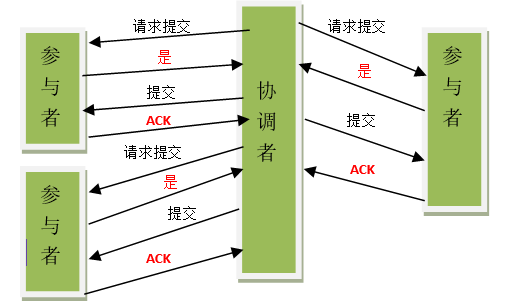

# 分步提交

## 什么是两步提交

在分布式系统中，每个节点虽然可以知道自己的操作是成功还是失败，但是无法知道其他节点的操作的结果。

需要引入一个作为协调者的组件来统一掌控所有节点的操作结果。

参与者将操作成败通知协调者，再由协调者根据所有参与者的反馈情报决定各参与者是否要提交操作还是中止操作。

## 两步提交的步骤

- 1. 协调者 X 让 提交者 ABC 执行事务操作
- 2. ABC 执行事务操作，上报执行结果
- 3. 协调者根据上报结果，确定最终的执行结果，并让执行者执行
  - 所有提交者都成功，结果是成功
  - 只要有一个提交者失败，结果就失败
- 4. ABC 根据协调者 X 提交的结果，来确定执行 commit 还是 rollback

## 两步提交是哪两步

- 提交执行的事务
- 提交最终的结果（commit、rollback）

## 两步提交存在什么问题吗

- ABC 内都是事务操作，存在锁，占用资源
- 协调者如果发生宕机，就会发生阻塞
- X 让 ABC 执行第二步提交的时候，不一定所有广播都成功了，会导致一部分节点最终提交了，一部分没有
- 二阶段无法解决的问题：协调者再发出commit消息之后宕机，而唯一接收到这条消息的参与者同时也宕机了。那么即使协调者通过选举协议产生了新的协调者，这条事务的状态也是不确定的，没人知道事务是否被已经提交。

