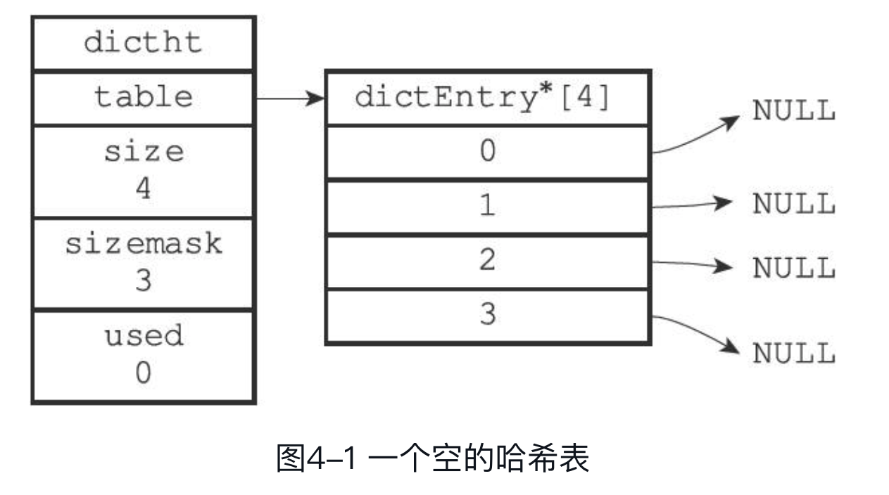
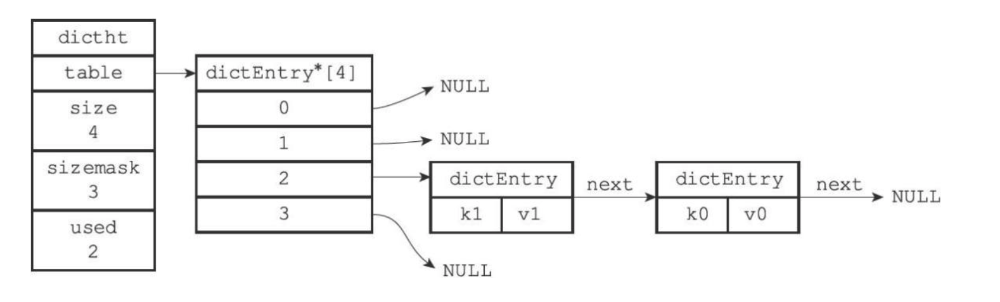
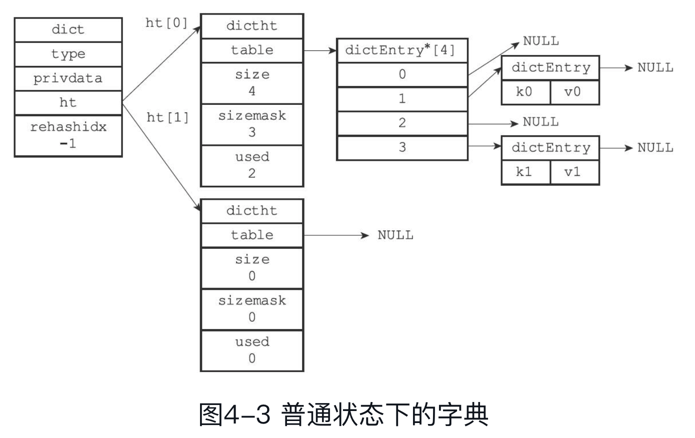
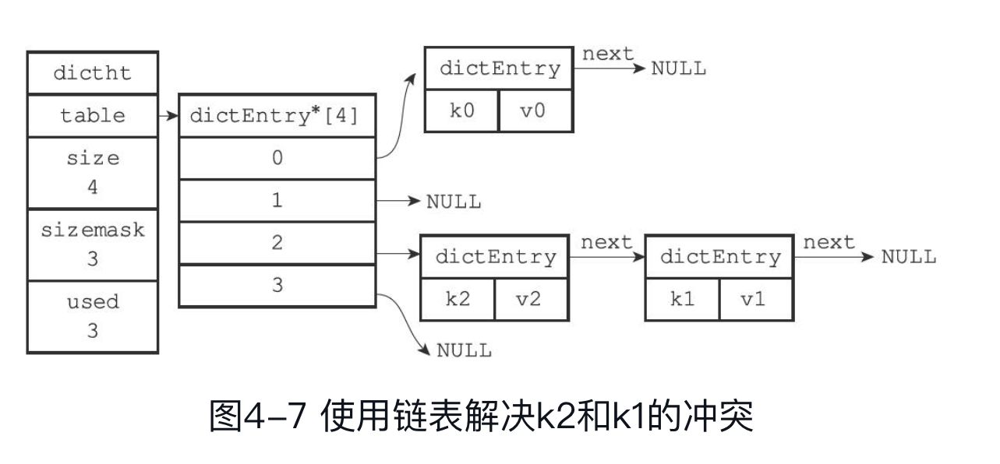

# 字典

字典的底层是用哈希表实现的

### 哈希表

哈希表的结构如下：

```go
type struct dictht {
    table []*dictEntry
    size uint64
    sizemask uint64
    used uint64
}
```

在初始化哈希表的时候，size 的大小是确定的

sizemask 永远等于 size - 1，sizemask 的目的是讲 hash 之后的 key 值缩小到哈希表的范围 [0, size) 中，以存储数据

used 存储了已经使用的节点的个数

used 和 size 结合起来还会确定什么时候缩容和扩容

table 是一个 dictEntry 的数组，dictEntry 存储真正的数据



### 哈希表的节点

哈希表的每个节点的数据结构都是 dictEntry

```go
type dictEntry {
    key interface{}
    v struct {
        val interface{}
        u64 uint64_t
        s64 int64_t
    }
    next *dictEntry
}
```

key 存储的是一对键值的键

v 存储的是一对键值的值。值可以是 uint64、int64或者是一个指针

next 指向另外一个 dictEntry 结构。

next 存在的意义是为了解决哈希冲突，当多个值 hash 到了同一个 key 的时候，就需要通过 next 实现链地址法解决哈希冲突

如下图，k0 和 k1 发生了哈希冲突



### 字典

上面介绍的哈希表只能处理简单的几个键值的情况，还有几个问题没有解决

- 哈希函数如何确定
- 当哈希冲突变多的时候，如何进行扩容
- 当数据非常稀疏的时候，如何缩蓉

所以我们提供了一个 dict 的结构对 dictht 进行包装

```go
type struct dict {
    type *dictType
    privdata interface{}
    ht [2]dictht
    rehashidx int
}
```

type 和 privdata 针对不同的数据类型实现了多态，以适用于不同的数据类型

ht 是一个长度为 2 的哈希表，通常，我们只会用到 id==0 的哈希表

但是当我们对字段进行缩扩容的时候，会使用到 id==1 的哈希表：将数据逐渐从 id==0 的哈希表迁移到 id==1 的哈希表

当缩扩容结束的时候，又是只有 id==0 的哈希表有数据

rehashidx 也是和缩扩容有关，没有在进行缩扩容的时候，rehashidx == -1

一个没有在进行缩扩容的字典：



### 添加一条数据的过程

针对不同的数据类型，哈希函数式不一样的

1. 哈希函数式定义在 `dict.type.hashFunction` 上的
2. 然后计算出键值的哈希结果
  - `hash = dict.type.hashFunction(key)`
3. 然后将哈希结果和 sizemark 进行按位与，以得到在 `dict.ht[x].table` 中的存储位置
  - `index = hash & dict.ht[x].sizemask`
4. 然后将数据存储到 dictEntry 中
  - `dict.ht[x].table[index] = &dictEntry{key: key, value: value, next: nil}`
5. 如果发生了哈希冲突怎么办？（即 `dict.ht[x].table[index]` 不为空）
  - 将新的数据放在哈希冲突链表第一个位置
  - `tmp = dict.ht[x].table[index]`
  - `dict.ht[x].table[index] = &dictEntry{key: key, value: value, next: nil}`
  - `dict.ht[x].table[index].next = tmp`



### 如何进行扩缩容

> 为什么需要扩容呢？

当数据越来越多的时候，因为容量是固定的，所以会越来越容易发生哈希冲突。

哈希冲突越来越多的时候，查找的效率是会降低的。

> 什么时候需要扩容

下面任意一个条件满足的时候，进行扩容
- 服务器没有在进行 BGSAVE 或者 BGREWRITEAOF 操作，并且负载因子大于等于 1
- 服务器正在进行 BGSAVE 或者 BGREWRITEAOF 操作，并且负载因子大于等于 5

> 什么是负载因子呢

负载因子 = dictht.used / dictht.size

> 为什么需要缩容呢

减少内存浪费

> 什么时候需要缩容

负载因子小于等于 0.1 的时候

> 如何进行扩缩容

首先我们先分配一个足够空间的哈希表，放在 ht[1] 的位置

然后当我们访问一个键值对的时候，我们先从 ht[0] 中查找，如果找不到再从 ht[1] 中查找

当我们从 ht[0] 中找到一个键值对的时候
  - 我们将 ht[0] 的 used 减一
  - 并且从 ht[0] 删掉这个数据
  - 然后将这个数据复制到 ht[1] 的合适的位置

当 ht[0].size 减少为 1 的时候，扩容就完成了

将 ht[1] 移动到 ht[0]，ht[1] 设为空

缩容也是差不多的原理

> 分配一个足够空间的哈希表的足够如何理解

首先：这个大小肯定是一个 2 的幂次方

- 如果我们是进行扩容操作：
  - 那么 ht[1] 的容量就是第一个大于等于 ht[0].used * 2 的 2 的幂次方
- 如果我们是进行缩容操作：
  - 那么 ht[1] 的容量就是第一个大于等于 ht[0].used 的 2 的幂次方