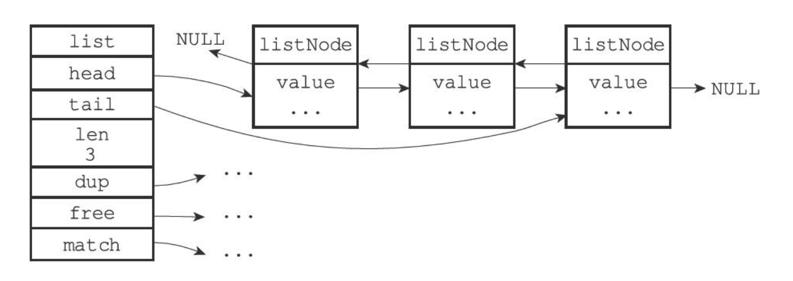

# 双向链表

### 双向链表的每个节点都是一个 listNode。

listNode 结构是一个双向链表，是本节所说的双向链表的数据存储所在。

```go
type listNode struct {
    prev *listNode
    next *listNode
    value interface{}
}
```

### 为了操作方便，还提供了一个 list 结构

list 结构包装了上面的 listNode 结构

```go
type list {
    head *listNode
    tail *listNode
    len uint64
}
```

head 结构指向了双向链表的第一个节点

tail 结构指向了双向链表的最后一个节点

len 结构存储了整个双向链表的节点个数


