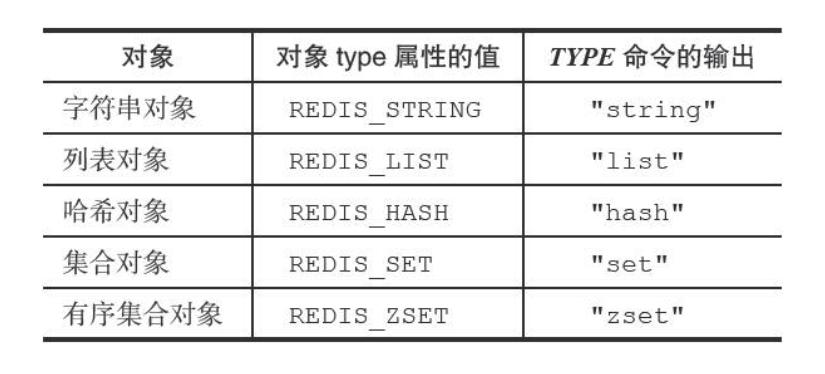
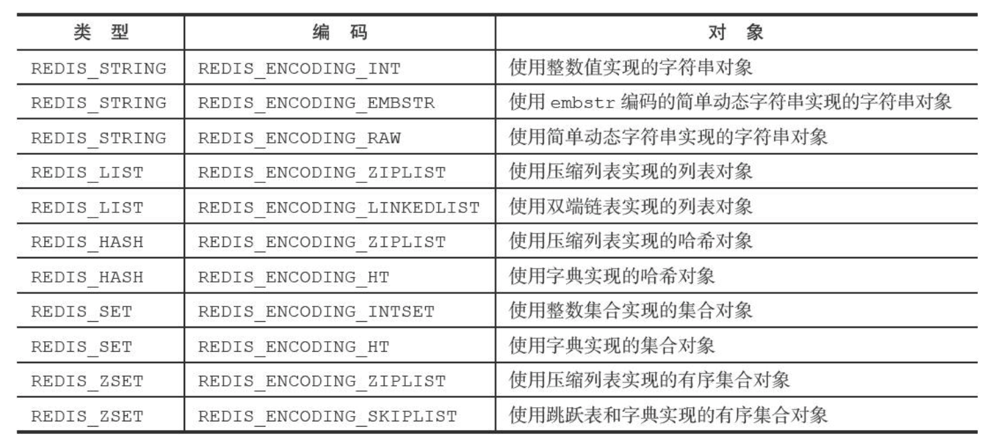

# 对象

redis 中所有的对象都是 redisObject

```go
type redisObject {
    type uint
    encoding uint
    ptr interface{}
}
```

## 对象的类型

redisObject.type 可以是以下的类型之一



`type` 命令可以查看对象的 type 值

## 对象的编码



使用 `object encoding` 命令可以查看编码

### 字符串对象 REDIS_STRING

* 如果这个字符串对象是一个数字，并且可以用 long 来表示，那么对应的是：
  * type = REDIS_STRING
  * encoding = REDIS_ENCODING_INT
* 如果这个字符串是一个字符串值，并且长度大于等于 32 字节，那么：
  * type = REDIS_STRING
  * encoding = REDIS_ENCODING_EMBSTR
* 如果这个字符串是一个字符串值，并且长度大于 32 字节，那么：
  * type = REDIS_STRING
  * encoding = REDIS_ENCODING_RAW

