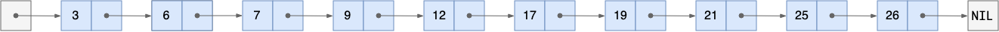
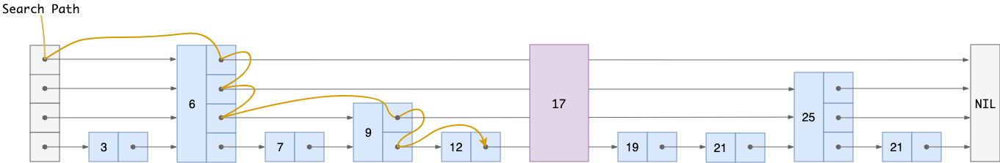

# 跳表

在数据结构的世界，我们可以用几个操作来对一个数据结构进行度量

* 查找一个数
* 插入一个数
* 删除一个数
* 范围查找

## 从单链表说起



上面的图示是一个单链表

```go
type listNode {
    value interface
    next *listNode
}
```

每个节点都存了指向下一个节点的指针，当前节点存储的值

单链表的操作时间复杂度

* 查找一个数：遍历，O(n)
* 插入和删除：O(1)

## 跳表的数据结构

```go
type listNode {
    backward *listNode
    level []struct {
        next *listNode
        span int
    }
    value interface
    score float64
}
```

如果只有 一层 level 节点和 value 节点，那么这个其实就是一个简单的单链表

score 节点是这个节点的分数、权重，在跳表中，用这个 score 排序

level 是一个数组，存储的每个值包含两个结构：span 和 next，next 是指向另一个 listNode 节点的指针，span 是当前节点和所指向的节点的距离

backward 是指向前一个节点的指针，这个数据用来向前遍历



## level 结构的作用

单链表为什么查询是 O(n) 的？

因为需要以此遍历链表中的所有数据，知道找到所需要的数据

level 是一个 [1, 32] 层数组，我们用 Ln 来代替数据中的第 n 个数据

level 数组中的 L1 节点指向下一个节点，如果跳表中只有 L1，那么这就是一个单链表

level 数组中的 L5 等节点会跳跃几个数据（span），然后指向一个数据

level 节点的层次越高，他所指向的节点越靠后，跳跃的节点越多

所以我们可以用更高层级的 level 指针来查询数据，这样就避免了 遍历链表的 O(n) 复杂度

## 跳表查询一个数据的过程

加上上面那个图还没有 17，我们现在需要插入 17。

> 从第一个 listNode 节点开始（第一个节点没有数据，仅有指针）

首先从第一个 listNode 的最高层的 level 指针开始，寻找他所指向的 listNode

找到了 6 ，因为 17 比 6 大，说明要寻找的节点在 6 这个节点的后面

> 第二个节点

然后获取 6 这个节点的最高层的 level 的指针

6 这个 listNode 的最高层 level 指向 null，没有找到一个合法的 listNode，所以忽略这个 level，降低 level

6 这个 listNode 的 `最高层-1` level 指向 25 这个 listNode，17 比 25 小，说明 17 应该出现在 25 之前，所以忽略这个 level，降低 level

6 这个 listNode 的 `最高层-2` level 指向 9 这个 listNode，17 比 9 大，说明 17 应该出现在 9 之后

> 第三个节点

然后获取 9 这个节点的最高层的 level 的指针

9 这个 listNode 的最高层 level 指向 25 这个 listNode，17 比 25 小，说明 17 应该出现在 25 之前，所以忽略这个 level，降低 level

9 这个 listNode 的 `最高层-1` level 指向 12 这个 listNode，17 比 12 大，说明 17 应该出现在 12 之后

> 第四个节点

然后获取 12 这个节点的最高层的 level 的指针

12 这个 listNode 的最高层 level 指向 19 这个 listNode，17 比 19 小，说明 17 应该出现在 19 之前

本来应该：**忽略这个 level，降低 level**

又因为上面这个 level 就是 L1，所以 17 这个节点就应该在 12 和 19 之间。


## 如何在跳表中插入一个数据

> 数据应该存到哪个位置

这个问题上面已经解释过了

> level 应该几层

```
p = 1/4
MacLevel = 32
randomLevel()
    lvl := 1
    -- random() that returns a random value in [0...1)
    while random in [0, 1) < p and lvl < MaxLevel do
        lvl := lvl + 1
    return lvl
```

伪代码如上所示

假设 level 为 1

然后不停的抛色子，只要他小于 0.25 ，就将 level + 1

直到 level 等于 32 或者 色子 大于等于 0.25


## 参考

* [跳表──没听过但很犀利的数据结构](https://lotabout.me/2018/skip-list/)
