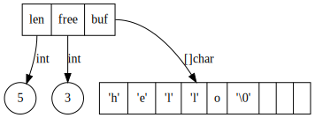

# 字符串

内部是 SDS

SDS 的全称是：simple dynamic string

数据结构是这样的：

* len，记录已经使用的数据的长度，不包括 `\0`
* free，记录还剩下的数据的长度
* buf，字符数据存储处，以 `\0` 结尾


```text
digraph G {
  node [shape=record]
  node1 [label="<f1> len | <f2> free | <f3> buf"]
  node1:f1 -> len [label="int"]
  node1:f2 -> free [label="int"]
  node1:f3 -> buf [label="[]char"]
  
  len [shape=circle label="5"]
  free [shape=circle label="3"]
  buf [label="'h' | 'e' | 'l' | 'l' | o | '\\0' | | | "]
}
```



SDS 有几个优点

* 求长度是 O\(1\) 的
  * 因为只需要返回 len 的数据即可
* 二进制安全的
  * 普通的 c 字符串，因为以 \0 结尾，所以无法在字符的中间包含 \0，但是 sds 可以
* 可以快捷的进行增删操作，而无需频繁申请和释放内存
* 避免溢出错误
  * 普通的 c 字符串，append 字符串的时候，可能会有溢出的错误
  * sds 因为知道数据的长度，所以可以预先进行扩容，不可能溢出


