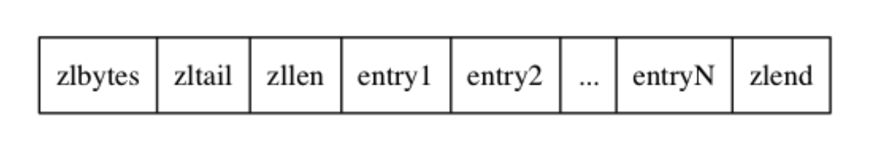
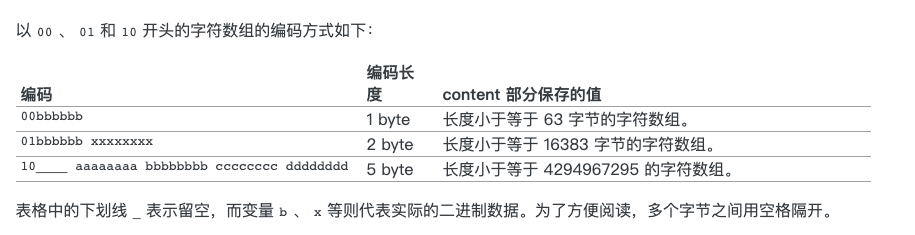
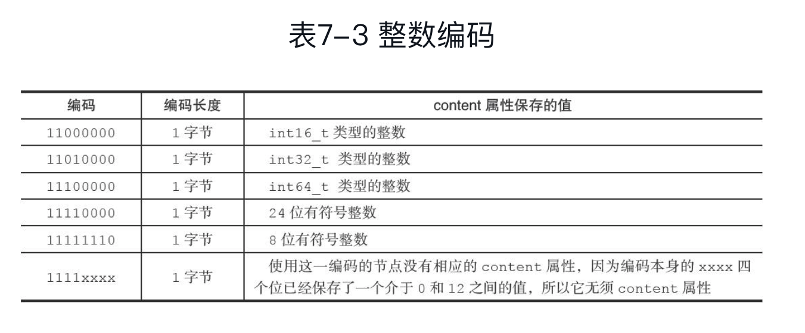

# 压缩列表



## 数据结构

```go
type ziplist {
    zlbytes uint32
    zltail uint32
    zllen uint16
    entry []struct{
        previous_entry_length []byte
        encoding
        content
    }
    zlend uint8
}
```

zlbytes 表示 ziplist 占用的字节大小

zltail 表示 ziplist 的表尾地址和表头地址的差值

zllen 表示 entry 存储的数据的个数

entry 是一个数组，存储了数据

zlend 是 `0x05`，表示 ziplist 的结束

## entry 的范围

每个 entry 可以存储一个字节数组或者是一个数字，具体存储的范围参考下表

* 字节数组
  * 长度小于等于 64\(2^6-1\) 的字节数组
  * 小于等于 16383\(2^14-1\)
  * 小于等于 4294967295\(2^32-1\)
* 数字
  * 4bit的位于 0-12 的无符号整数
  * 1字节的有符号整数
  * 3字节的有符号整数
  * int16
  * int32
  * int64

## entry 的结构

```go
type entry struct{
    previous_entry_length []byte
    encoding []byte
    content
}
```

## entry 的 previous\_entry\_length

previous\_entry\_length 是一个字节数组，长度不定，记录了上一个 entry 的长度

* 如果第一个字节是 `0xFE`，那么后续还会有 4 个字节，用于存储上一个 entry 的长度，previous\_entry\_length 总长为 5 个字节
* 否则，previous\_entry\_length 总长就是 1 个字节，用于存储上一个 entry 的长度

因为 previous\_entry\_length 记录了上一个 entry 的长度，所以可以通过这值和当前节点的地址，求出上一个 entry 的起始地址

ziplist 从后先前的遍历操作就是使用 previous\_entry\_length 实现的

## entry 的 encoding

encoding 是一个长度不定的字节数据，记录了 content 的长度和格式

### content 的数据类型问题

* 如果 encoding 的前两个 bit 为 `00`，`01`，`10`，那么 content 是一个 bytes
* 如果 encoding 的前两个 bit 为 `11`，那么 content 是一个数字

### content 的 bytes 长度问题

* 如果 encoding 的前两个 bit 为 `00`，那么 encoding 是 长度为 1 的 bytes
  * 剩下 6 个 bit 存储了content 的 bytes 长度，最大可以是 2^6-1 字节
* 如果 encoding 的前两个 bit 为 `01`，那么 encoding 是 长度为 2 的 bytes
  * 剩下 6+8 个 bit 存储了content 的 bytes 长度，最大可以是 2^14-1 字节
* 如果 encoding 的前两个 bit 为 `10`，那么 encoding 是 长度为 5 的 bytes
  * 剩下 8\*4 个 bit 存储了content 的 bytes 长度，最大可以是 2^32-1 字节
  * 长度为 5 有一个特殊的地方，忽略了第一个字节剩下的 6 个 bit



### content 的数字大小问题

* 如果 encoding 的前两个 bit 为 `11`，那么 content 就是一个数字



### 连锁更新

